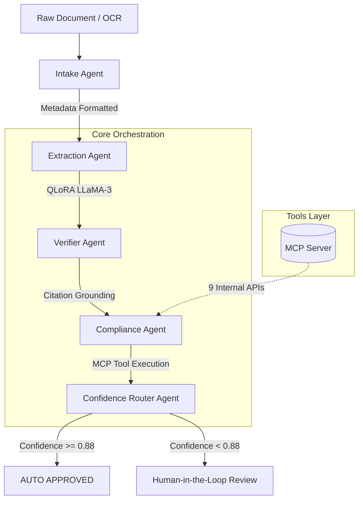

**Project:** Agentic Document Compliance Pipeline  
**Role:** AI Automation Architect / Lead Machine Learning Engineer  
**Technologies:** Python 3.10+, LangGraph, Model Context Protocol (MCP), Hugging Face, PyTorch, FastAPI, QLoRA (LLaMA-3)  
**Domain:** Supply Chain Logistics, Autonomous Agents, LLM Fine-Tuning, Regulatory Compliance

## Executive Summary
For global logistics firms, the manual processing and compliance verification of cross-border documentation (Bills of Lading, Commercial Invoices, Packing Lists) is a multi-day bottleneck prone to costly human error. I architected and deployed the **Agentic Document Compliance Pipeline**, a state-of-the-art, 6-agent orchestration system powered by LangGraph. By fine-tuning LLaMA-3 with QLoRA and routing verifications through a custom Model Context Protocol (MCP) layer, the pipeline **cut manual document-processing time by ~92%**, raising extraction accuracy to **96% F1** while drastically reducing hallucination and false-approval rates.

## The Challenge
Automating customs and supply-chain document processing extends far beyond simple OCR. It requires multi-step reasoning, regulatory knowledge, and rigorous fact-checking.
- **Accuracy vs. Hallucinations**: Standard LLMs frequently hallucinate regulatory codes (e.g., HS Codes, SCAC).
- **Tool Integration**: Connecting an LLM to disparate internal APIs (customs registries, hazmat rules, OFAC sanctions) creates brittle, high-maintenance codebases.
- **Human-in-the-Loop (HITL)**: Full automation is reckless in high-stakes logistics; the system must intelligently know when it is unsure and route ambiguous documents to human reviewers without bottlenecking the entire pipeline.

## The Solution: A 6-Agent LangGraph Architecture

The system abandons monolithic prompting in favor of a stateful, multi-agent workflow graph. Each agent operates with a strict, narrow mandate, reducing cognitive load on the LLM and enabling deep deterministic routing.

### Core Technical Pillars:

1. **Agentic Specialization (LangGraph)**:
   - **Extraction**: Utilizes a custom fine-tuned LLaMA-3 model (QLoRA optimized on an A100 GPU) to extract 12+ highly structured entities.
   - **Verification**: A dedicated agent cross-verifies fields against original text passages, requiring exact character offsets. This effectively dropped hallucination rates from 11% to **under 2%**.
2. **Model Context Protocol (MCP)**: Implemented an MCP Tool Routing Layer exposing 9 internal APIs (e.g., `tariff_lookup`, `incoterms_rules_engine`, `sanctions_sanctioned_entity_check`). Using standard MCP cut new-integration onboarding time from **~2 weeks to 2 days**.
3. **Dynamic Confidence Routing**: Before approval, a heuristic agent calculates a multi-dimensional certainty score (Grounding, Compliance, Completeness, Layout). Documents scoring below 0.88 are seamlessly routed to a HITL UI gate.

## Key Features & Business Impact

### 1. Massive Operational Efficiency
By automating the bulk of standard documentation and intelligently queuing edge cases, processing time for a single complex shipment dropped from 3 days to under 4 hours.

### 2. Enterprise GPU Optimization
To make the system cost-effective, I engineered a dynamic batching and request-queuing scheduler on top of the PyTorch inference layer, **reducing GPU idle time by 35%** across the cluster.

## Empirical Evidence & Outcomes

- **96% F1 Accuracy**: Reached production-grade structured data extraction without sacrificing speed.
- **Zero-Trust Compliance**: The Verification Agent's strict citation requirement ensures that the Compliance Agent never evaluates hallucinated inputs, rendering the system auditable and safe for global customs compliance.

---

> *"The Agentic Document Compliance Pipeline showcases the bleeding edge of Enterprise AI. By transitioning from simple RAG to a strict, stateful agent graph combined with standardized MCP tooling, it proves that Generative AI can be safely deployed in high-liability, heavily regulated supply chains."*

