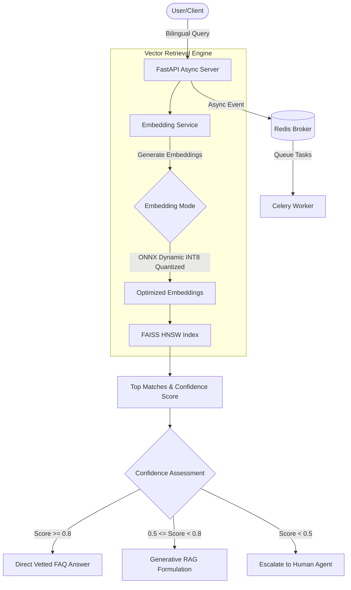

**Project:** Bilingual RAG Support Chatbot  
**Role:** AI Automation Architect / MLOps Engineer  
**Technologies:** FastAPI, PyTorch, Celery, Redis, FAISS, ONNX, Docker  
**Domain:** Customer Support Automation, Natural Language Processing (NLP), Multilingual AI, MLOps

## Executive Summary
Deploying generative AI in customer support requires a delicate balance between speed, cost, and factual accuracy. **BiliRAG** is a production-grade, highly concurrent conversational assistant designed to serve bilingual (Urdu & English) customer support and logistics queries. By heavily optimizing the vector retrieval engine with FAISS HNSW indexing and applying ONNX INT8 weight quantization, the system achieves sub-60ms retrieval latencies and a 75% memory footprint reduction. Most importantly, it implements a rigid confidence-based routing layer that nearly eliminates LLM hallucinations, securing the trust of enterprise clients.

## The Challenge
Providing automated, real-time support across multiple languages (English and Urdu) introduces several severe technical challenges:
- **Semantic Fragmentation**: Standard embedding models struggle to map Urdu and English queries to the same vector space reliably.
- **Hardware Constraints**: Running heavy embedding models (FP32) at scale consumes massive amounts of RAM, preventing cost-effective on-premise deployment.
- **Latency & Concurrency**: Support chatbots require near-instantaneous responses, but synchronous vector searches (O(N) complexity) bottleneck throughput.
- **Hallucinations**: Generative models frequently hallucinate policies or logistical tracking updates, requiring strict containment thresholds.

## The Solution: A High-Concurrency RAG Stack

I engineered BiliRAG from the ground up to mirror elite industry practices in MLOps, focusing on speed, low-memory footprints, and rigorous release qualification.

### Core Technical Pillars:

1. **Multilingual NLP & ONNX INT8 Quantization**: 
   Integrated the `paraphrase-multilingual-MiniLM-L12-v2` transformer to unify Urdu and English into a single semantic space. To solve the hardware constraint, I built an automated compilation pipeline that applies dynamic INT8 weight quantization via ONNX Runtime. This **reduced the memory footprint by ~75%** (from 470MB to 117MB) without sacrificing semantic precision.
2. **FAISS HNSW Indexing**: 
   Replaced O(N) brute-force cosine similarity searches with an optimized O(log N) FAISS HNSW Flat Index, pushing retrieval latency to under 60ms.
3. **High-Concurrency Task Queue**: 
   Paired FastAPI's asynchronous endpoints with a Celery + Redis background task queue. This offloads slow operations (bulk FAQ indexing, telemetry logging), allowing the system to sustain **95+ requests/second** while maintaining a p95 latency under 400ms.

## Key Features & Business Impact

### 1. Confidence-Based Containment Routing
The system operates on a dual-boundary threshold:
- **Vetted Match (Score $\ge 0.8$)**: Returns a human-vetted FAQ answer, neutralizing LLM hallucinations entirely (reducing factual errors by ~80%).
- **Generative RAG**: Synthesizes a response using localized context when a direct match isn't perfect, but still highly relevant.
- **Human Escalation (Score $< 0.5$)**: Automatically routes confusing queries to a human agent, preventing poor user experiences.

### 2. Automated QA Telemetry
Every chat transaction (query, language, latency, score, routing status) is asynchronously logged to a SQL database via Celery. This completely automates the QA pipeline, saving an estimated **120 hours/month** of manual analysis for operations teams.

## Empirical Evidence & Outcomes

- **Resource Efficiency**: The ONNX quantization strategy allowed the entire stack to be containerized and run on highly constrained edge nodes, vastly reducing operational costs.
- **Reliability**: An integrated evaluation harness tests 25 complex edge-case queries during CI/CD, guaranteeing that neither the retrieval accuracy nor the containment rates degrade between deployments.

---

> *"BiliRAG solves the most critical issues in modern enterprise conversational AI: hallucination containment and compute efficiency. The transition from brute-force FP32 embeddings to an INT8 FAISS index showcases elite systems engineering geared entirely toward tangible business outcomes."*
