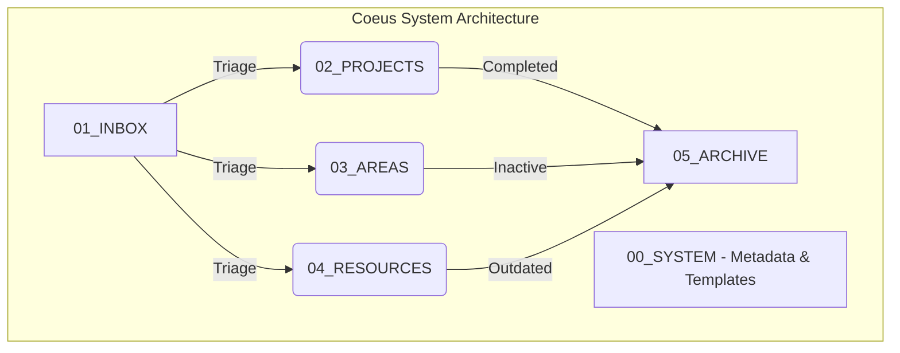

**Project:** Coeus  
**Role:** Systems Architect  
**Technologies:** Obsidian, Markdown, PARA Method  
**Domain:** Personal Knowledge Management (PKM), Productivity, System Design

## Executive Summary
For founders, engineers, and high-output professionals, information overload is a critical bottleneck. **Coeus** is a robust Personal Knowledge Management (PKM) system built entirely on local, plain-text Markdown within Obsidian. Designed around Tiago Forte's PARA method (Projects, Areas, Resources, Archive), Coeus acts as a highly structured "Second Brain," allowing for frictionless capture, systematic organization, and rapid retrieval of complex technical, business, and personal data.

## The Challenge
High-performing individuals constantly ingest high-value information—from architectural whitepapers and meeting notes to business strategies and passing insights. Traditional note-taking apps suffer from:
- **Vendor Lock-in**: Proprietary formats make exporting data difficult.
- **Organizational Chaos**: Lack of a disciplined structure leads to "note bankruptcy."
- **Retrieval Friction**: Without deep linking and structural schemas, finding an old insight when it's needed is nearly impossible.

## The Solution: The PARA Method on Plain Text

I engineered Coeus not as a piece of software, but as an architectural system applied to plain text. 

### Core Structural Pillars:

1. **Future-Proof Plain Text**: By relying strictly on standard Markdown files, the knowledge base is entirely immune to software discontinuation and can be tracked securely via Git.
2. **The PARA Taxonomy**: 
   - `01_INBOX`: The friction-free landing zone for raw, unformatted capture.
   - `02_PROJECTS`: Active, bound efforts with strict deadlines and goals (e.g., shipping a specific client app).
   - `03_AREAS`: Spheres of continuous activity and responsibility with no end date (e.g., Health, Finances, Software Engineering).
   - `04_RESOURCES`: Topics of ongoing interest and reference material (e.g., Code snippets, Design patterns).
   - `05_ARCHIVE`: Inactive items from the above categories, preserved for searchability without cluttering the active workspace.
3. **Graph-Linked Thinking**: Leveraging Obsidian's bidirectional linking to create a highly networked structure, allowing ideas to cluster organically and uncover previously unseen connections between distinct disciplines.

## Key Features & Business Impact

### 1. Frictionless Triage
The strict `00_SYSTEM` directory houses standardized templates and metadata (frontmatter) guidelines. This ensures that when an insight is captured into the `01_INBOX`, standardizing and moving it into its permanent home takes seconds.

### 2. Cognitive Offloading
By trusting a rigid, externalized system, the mental overhead required to track active projects and references is completely offloaded. This provides the user—whether acting as a lead developer or agency founder—with the mental bandwidth required for deep, focused execution.

## Empirical Evidence & Outcomes

- **Zero-Latency Search**: Local markdown processing ensures that querying thousands of interlinked documents happens instantly.
- **Portability and Security**: Hosted entirely locally with Git version control, guaranteeing that proprietary business plans and raw intellectual property are never scraped by cloud vendors or lost to server outages.

---

> *"Coeus isn't just a collection of notes; it's a structural operating system for the mind. By combining the rigid discipline of the PARA method with the fluidity of graph-linked markdown, it transforms scattered data into compounded intellectual capital."*
