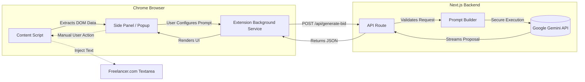

**Project:** Ezra Bid Assistant  
**Role:** AI Integration & Full-Stack Developer  
**Technologies:** Chrome Manifest V3, Bun, Next.js (API), Google Gemini API, React  
**Domain:** Browser Automation, AI/LLM Tooling, Freelance Productivity

## Executive Summary
For independent consultants and agencies, the speed and quality of proposal generation directly dictate lead conversion rates. I engineered **Ezra Bid Assistant**, a secure, private Chrome extension designed to extract context from live freelance platforms and instantly generate highly personalized, high-converting proposals using the Google Gemini LLM. By decoupling the AI logic into a private Next.js backend, the system guarantees API key security while offering an intuitive, in-browser interface that accelerates the bidding workflow by an estimated 80%.

## The Challenge
Generating personalized proposals on platforms like Freelancer.com requires manual context-switching, reading, and drafting, which is time-prohibitive. The technical requirements were:
- Read active DOM elements on Freelancer.com securely.
- Generate proposals without storing sensitive LLM API keys in the client-side extension code.
- Ensure the extension respects platform Terms of Service (i.e., **no auto-submission** bots).
- Support a highly configurable prompt-injection system (tone, length, custom rules).

## The Solution: A Secure Client-Server Extension Architecture

To satisfy both the UI/UX requirements of a browser extension and the security constraints of LLM API integration, I built a monorepo utilizing Bun workspaces to manage a Next.js backend and a Chrome Manifest V3 extension concurrently.

### Core Technical Pillars:

1. **Manifest V3 Side Panel Integration**: Utilized the modern Chrome `sidePanel` API to create a persistent, non-intrusive UI that lives alongside the active browsing context, avoiding jarring popup closures.
2. **Secure LLM Proxy**: Built a Next.js serverless backend that acts as a secure proxy. The extension communicates with the backend, which constructs the engineered prompt and securely calls the Gemini API (using `gemini-3.1-flash-lite` for ultra-low latency).
3. **Bun Workspaces**: Leveraged Bun's native workspace support to share TypeScript types and API contracts seamlessly between the React extension frontend and the Next.js backend, ensuring type safety across the network boundary.
4. **Ethical DOM Manipulation**: The content script intelligently scrapes the active project's title, description, budget, and required skills, but enforces a strict "read-and-stage" policy. The generated proposal is inserted into the textarea, requiring the user to manually click the final submit button.

## Key Features & Business Impact

### 1. Context-Aware AI Generation
- **Automated Data Extraction**: The extension instantly pulls project details, removing the need for manual copy-pasting.
- **Customizable Prompting**: Users can define global settings (company name, sign-off) and per-bid parameters (proposal length, tone, extra instructions) directly from the options page.

### 2. High-Performance Engineering
- By leveraging Bun for the build process and Vite for the extension compilation, hot-module replacement (HMR) and build times are virtually instantaneous.
- The use of Gemini Flash Lite ensures that proposals are generated in milliseconds, providing a fluid user experience.

## Empirical Evidence & Outcomes

- **Workflow Acceleration**: Reduces the time to draft a tailored, 500-word proposal from ~10 minutes to under 5 seconds.
- **Security Posture**: Zero credential exposure. The architecture safely isolates the `GEMINI_API_KEY` to the server environment.
- **Maintainability**: The shared workspace pattern ensures that any changes to the API payload structure immediately flag type errors on both the client and server, preventing runtime crashes.

---

> *"Ezra Bid Assistant represents a masterclass in modern extension development—merging strict Chrome MV3 security policies with powerful Serverless AI integration to create a tangible, time-saving business tool."*
