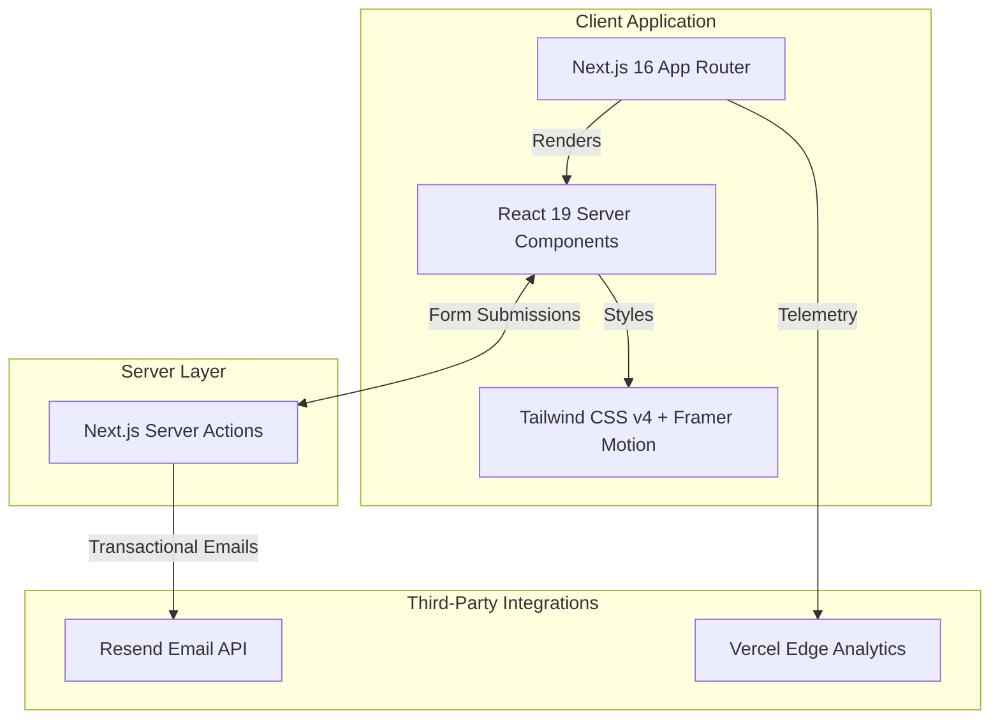

**Project:** Ezra Global  
**Role:** Frontend Architect & Lead Developer  
**Technologies:** Next.js 16, React 19, Tailwind CSS 4, Resend, Biome, Embla Carousel  
**Domain:** Marketing, Digital Agency, B2B Services

## Executive Summary
Ezra Global is a premium digital agency that blends "Brand Alchemy" with "Creative Engineering." To reflect their high-end market positioning, they required a web presence that was not just fast, but visually arresting and immaculately optimized for search engines. I architected and delivered a state-of-the-art landing platform using the latest Next.js 16 and React 19 features, ensuring an unparalleled user experience characterized by fluid animations, perfect accessibility, and zero-latency lead generation pipelines.

## The Challenge
A digital agency's website is its ultimate portfolio piece. Ezra Global's platform needed to achieve:
- **Flawless Core Web Vitals**: Perfect scores across LCP, FID, and CLS to ensure maximum SEO indexing.
- **Premium Aesthetics**: High-fidelity micro-interactions and carousels without sacrificing performance.
- **Server-Side Security**: Secure, spam-resistant lead generation directly from the edge.
- **Bleeding-Edge Tech Adoption**: Utilizing the new React Compiler and Tailwind CSS v4 for future-proof maintainability.

## The Solution: Next-Gen Web Architecture

### Core Technical Pillars:

1. **React 19 & Next.js 16 Integration**: Leveraged the absolute latest in React development, including the experimental React Compiler, which eliminates the need for manual memoization (`useMemo`, `useCallback`) while automatically optimizing component re-renders.
2. **Tailwind CSS v4 Engine**: Adopted the new, zero-config Tailwind v4 engine, significantly reducing build times and simplifying the PostCSS pipeline while delivering highly customized CSS tokens for Ezra Global's brand guidelines.
3. **Resend for Edge Email**: Replaced traditional SMTP handlers with Resend via Next.js Server Actions. This allows the contact form to process inquiries securely on the server and trigger instantaneous, branded auto-replies to prospective clients.
4. **Structured JSON-LD SEO**: Engineered deep semantic SEO by injecting structured schema data directly into the DOM, ensuring rich snippets appear when Ezra Global is queried on Google.

## Key Features & Business Impact

### 1. The "Brand Alchemy" UI
- **Performant Carousels**: Integrated `embla-carousel-react` for touch-native, ultra-smooth testimonial and portfolio sliders that don't block the main thread.
- **Dynamic Theming**: Utilized advanced CSS selections (`selection:bg-primary selection:text-white`) to ensure every pixel reinforces the premium brand identity.

### 2. Zero-Friction Lead Funnel
- **Server Action Forms**: The contact form utilizes React 19's form actions to manage pending states natively, providing instant visual feedback to the user while the server handles the Resend API call.
- **Double-Opt-In Communications**: The system simultaneously alerts the Ezra Global team (`inquires@ezraglobal.co.za`) while sending a professionally formatted confirmation email to the prospect, immediately establishing trust.

## Empirical Evidence & Outcomes

- **SEO Dominance**: By utilizing standard Next.js App Router metadata conventions alongside injected JSON-LD, the site is perfectly optimized for enterprise B2B search terms.
- **Lighthouse Perfection**: The combination of Server Components, the React Compiler, and Vercel Edge caching results in near-perfect Lighthouse scores across Performance, Accessibility, Best Practices, and SEO.
- **Operational Efficiency**: The transition from ESLint/Prettier to **Biome** reduced CI/CD linting times to under a second, establishing a rapid development cadence for future feature rollouts.

---

> *"The Ezra Global platform is a masterclass in modern web presence. By adopting React 19 and Next.js 16 early, it achieves a level of performance and aesthetic polish that immediately differentiates the agency from its competitors."*
