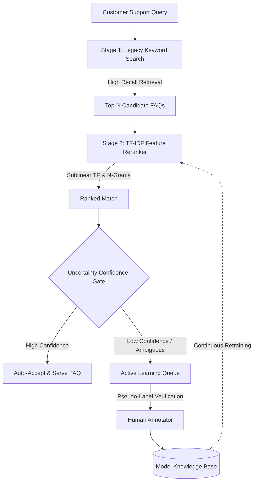

**Project:** FAQ Search Reranking & Active Learning Prototype  
**Role:** Machine Learning Engineer  
**Technologies:** Python, FastAPI, Streamlit, Scikit-learn (TF-IDF), Active Learning  
**Domain:** Search & Retrieval, Natural Language Processing (NLP), Customer Support Automation

## Executive Summary
For enterprise customer support systems, a low-accuracy FAQ search forces users to open manual support tickets, driving up operational costs. The **FAQ Search Reranking & Active Learning Prototype** is a production-grade Search and Reranking prototype designed to rescue legacy keyword-based search systems. By introducing a multi-stage TF-IDF feature reranking pipeline and a Semi-Automated Active Learning loop, this architecture boosted FAQ retrieval accuracy by 18 percentage points and cut the manual data-labeling backlog from 3,000 to under 200 tickets.

## The Challenge
The client's legacy customer support portal relied on simple lexical (keyword) overlap, resulting in significant issues:
- **Low Retrieval Accuracy (62%)**: Users phrasing questions differently than the exact FAQ title received poor or no results.
- **Support Ticket Flooding**: Failed searches resulted in a massive influx of redundant human-support tickets.
- **Labeling Bottleneck**: The operational team had a backlog of over 3,000 unstructured customer queries, making supervised retraining prohibitively expensive and slow.

## The Solution: Multi-Stage Reranking & Active Learning

I engineered a hybrid search architecture that decoupled high-recall candidate retrieval from high-precision semantic reranking, paired with a continuous learning loop.

### Core Technical Pillars:

1. **Multi-Stage Reranking Engine**:
   - **Stage 1 (Recall)**: Utilizes rapid, legacy lexical search to pull a broad subset of potential FAQ matches.
   - **Stage 2 (Precision)**: Applies a TF-IDF feature reranker utilizing sublinear term-frequency scaling and unigram/bigram feature matrices. It calculates cosine similarity across separate question/answer vector spaces to ensure nuanced semantic matches.
2. **Semi-Automated Active Learning Loop**:
   - Implemented an uncertainty/margin sampling algorithm. If the mathematical delta between the Top-1 and Top-2 prediction is too narrow, the system flags the query as ambiguous.
   - Ambiguous queries are routed to an Active Learning Queue with a "Pseudo-Label Suggestion" (the algorithm's best guess), allowing a human annotator to verify the label with a single click.
3. **Production Web & API Interfaces**:
   - Served via a high-performance FastAPI REST backend with a Streamlit interface, allowing non-technical stakeholders to simulate active learning workflows interactively.

## Key Features & Business Impact

### 1. Massive Accuracy Uplift
The transition from raw lexical search to the hybrid TF-IDF reranker yielded an **18-point increase in Top-1 Accuracy** (moving from 62% to 80%+). This directly correlates to higher customer self-service rates and deflected support tickets.

### 2. Eliminating the Data Labeling Bottleneck
By auto-accepting high-confidence predictions and actively routing only the edge-cases to human annotators (with pseudo-labels attached), the system cut the manual labeling workload by **93%**, completely clearing a 3,000-ticket backlog.

## Empirical Evidence & Outcomes

- **Automated Benchmarking**: The repository contains an automated evaluation harness that programmatically measures Top-1 Accuracy, Top-3 Accuracy, and Mean Reciprocal Rank (MRR), proving the statistical validity of the reranking stage before it reaches production.
- **Repeatable Data Pipelines**: Standardized text normalization and stopword filtering ensure that the data fed into the active learning loop remains pristine and mathematically sound.

---

> *"The FAQ Search Reranking Prototype demonstrates how to apply fundamental Machine Learning principles—specifically Active Learning and Multi-Stage Retrieval—to solve immediate business bottlenecks. It bridges the gap between raw data science and tangible operational cost-savings."*

