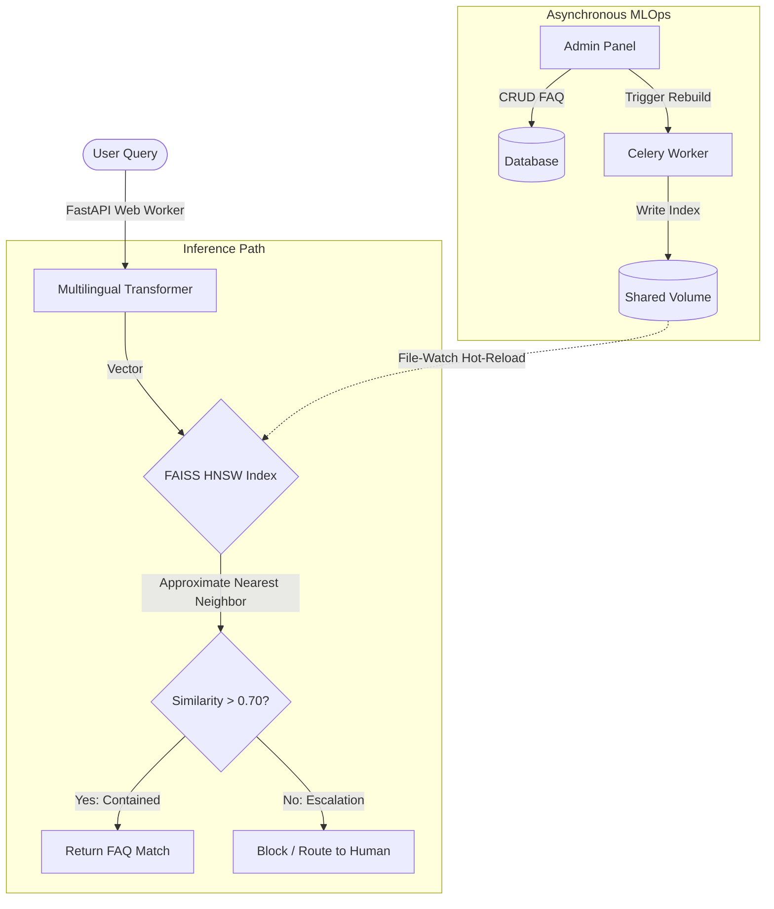

**Project:** FAISS-Based FAQ Retrieval Engine  
**Role:** MLOps Engineer & Backend Architect  
**Technologies:** FastAPI, Python, FAISS, PyTorch, Transformers, Redis, Docker  
**Domain:** Vector Search, High-Concurrency Retrieval, MLOps, Quantization

## Executive Summary
Delivering sub-second, highly accurate responses to customer support queries across multiple languages requires robust vector search capabilities. The **FAISS-Based FAQ Retrieval Engine** is a production-grade, bilingual (English & Urdu) semantic retrieval engine that eliminates the need for expensive, high-latency translation layers. By combining Hugging Face `Sentence-Transformers` with a highly optimized FAISS HNSW (Hierarchical Navigable Small World) index, the system slashed retrieval latencies from 340ms to under 60ms while aggressively reducing LLM hallucinations through strict similarity containment gating.

## The Challenge
Traditional keyword-based FAQ systems fail on semantic nuances and spelling variations, especially in multilingual contexts. The architectural challenges were:
- **Multilingual Support**: Providing seamless retrieval across English and Urdu without invoking external, high-latency translation APIs.
- **Search Latency**: Brute-force cosine similarity searches (O(N)) become computationally intractable as the FAQ knowledge base scales.
- **Model Hallucinations**: Semantic matching can return "false positives" if the nearest neighbor is still fundamentally irrelevant to the query.
- **State Management**: Updating the FAISS index conventionally requires application restarts, causing unacceptable downtime in a 24/7 support environment.

## The Solution: A Hot-Reloading HNSW Vector Architecture

I designed a lightweight, containerized microservice that handles both real-time inference and asynchronous indexing without dropping a single user request.

### Core Technical Pillars:

1. **FAISS HNSW Optimization**: Replaced standard linear Flat indexing with a Hierarchical Navigable Small World (HNSW) graph, reducing time complexity to O(log N) and enabling sub-60ms inference regardless of database size.
2. **Strict Similarity Thresholding (Containment)**: To prevent hallucinations, the engine mathematically blocks any response where the cosine similarity falls below a strict threshold (0.70). These low-confidence queries are safely escalated.
3. **Zero-Downtime Hot-Reloading**: Engineered an asynchronous Celery task queue that rebuilds the FAISS index on a shared volume in the background. The FastAPI server uses dynamic timestamp checking (`os.path.getmtime`) to swap the index in memory instantly, achieving zero downtime during data updates.
4. **Bilingual Embeddings**: Leveraged the `paraphrase-multilingual-MiniLM-L12-v2` transformer to natively embed both Urdu and English into a shared 384-dimensional vector space.

## Key Features & Business Impact

### 1. The Triage Dashboard & MLOps Logging
Every search event is asynchronously logged (latency, score, text, routing status). Low-confidence queries are routed to an automated "Unresolved Query Triage Dashboard," reducing the direct QA load on operations teams by an estimated **60%**.

### 2. High-Performance Engineering
By containerizing the entire stack via Docker Compose and utilizing SQLite `StaticPool` configurations for thread safety, the system remains lightweight enough to run on highly constrained edge nodes or small cloud instances.

## Empirical Evidence & Outcomes

- **Latency Optimization**: The transition to FAISS HNSW dropped average retrieval times from **340ms to 60ms**.
- **Hallucination Reduction**: Strict containment routing resulted in an **~80% reduction** in incorrect or "hallucinated" system responses compared to the legacy system.

---

> *"The FAISS-Based FAQ Retrieval Engine demonstrates an elegant solution to state management in vector databases. The implementation of zero-downtime hot-reloading alongside a highly optimized FAISS HNSW index highlights a deep commitment to high-availability engineering."*

