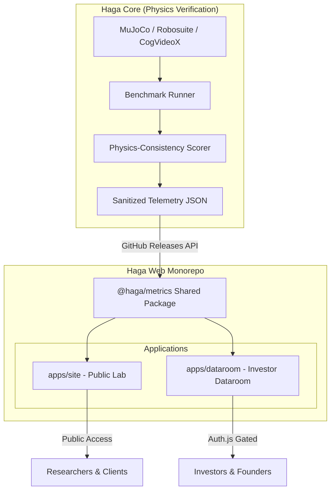

**Project:** Haga - Independent Physical AI Verification Platform & Dual-Surface Web Architecture  
**Role:** Robotics AI Engineer & Full-Stack Architect  
**Technologies:** Python, MuJoCo, Robosuite, PyTorch, Next.js (App Router), PNPM Monorepo, Auth.js, Tailwind CSS  
**Domain:** Physical AI, Robotics Verification, B2B Platform, Synthetic Data, Investor Relations  

## Executive Summary  
As Physical AI (robotics, autonomous systems) rapidly transitions to training via synthetic data and simulated world models, the industry faces a crisis of trust: labs self-report benchmarks, and synthetic environments often suffer from undetected physics inconsistencies. **Haga** is a complete, end-to-end Physical AI verification platform comprising **Haga Core** (a Python-based verification layer that stress-tests robot learning policies in MuJoCo) and **Haga Web** (a secure PNPM monorepo with dual Next.js surfaces for public research marketing and private investor diligence). Together, this architecture delivers independent, third-party validation for Physical AI startups while airgapping source code and gating sensitive telemetry.

## The Challenge  
Evaluating Physical AI policies and presenting benchmarking evidence presents a dual technical hurdle:
1. **Simulation & Physics Verification**: Robot learning labs lack third-party tools to detect object permanence failures, impossible accelerations, or mass/friction policy thresholds.
2. **Dual-Surface Trust Architecture**: Haga needed a web infrastructure to publicly publish sanitized benchmark metrics for researchers while maintaining a cryptographically gated, invite-only dataroom for investors without risking IP exposure or data drift between public claims and private financials.

## The Solution: Core Physics Engine & Dual-Surface Monorepo

### Core Technical Pillars:

1. **Deterministic Physics Benchmarking (Haga Core)**: Interfacing directly with `mujoco` and `robosuite`, the Python benchmark runner systematically perturbs environmental variables (mass, friction, damping) across thousands of episodes to calculate policy failure thresholds.
2. **Physics-Consistency Scoring (PhysicsIQ)**: Utilizing OpenCV and PyTorch (`cotracker`), Haga Core analyzes AI-generated video frames to detect spatial anomalies and non-Newtonian movement.
3. **PNPM Workspaces & Zero-Drift Data Architecture**: Haga Web is structured as a monorepo with shared packages (`@haga/brand` and `@haga/metrics`). Both the public site and private dataroom consume identical sanitized JSON telemetry from Haga Core via GitHub Releases.
4. **Gated Dataroom Security**: `apps/dataroom` utilizes Auth.js allowlisting and cryptographic business logic (`incorporation.ts`) to release sensitive operational data to investors based on legal funding milestones.

## Key Features & Business Impact

### 1. Verification-as-a-Service
Provides actionable "Pass/Fail/Score" metrics for robot learning policies before deployment to multi-million-dollar hardware setups.

### 2. Airgapped Public/Private Surfaces
Allows researchers to view live benchmarking metrics on the public site, while enabling founders to run confidential investor diligence in an MDX-powered dataroom without direct database access to the core physics engine.

## Empirical Evidence & Outcomes

- **Reproducibility**: Strict Python dependency management (`pyproject.toml`) and automated GitHub Actions CI guarantee benchmark parity across local and cloud environments.
- **Zero-Drift Guarantee**: Both public site and private dataroom import the exact same `@haga/metrics` package, guaranteeing public claims match private investor data.
