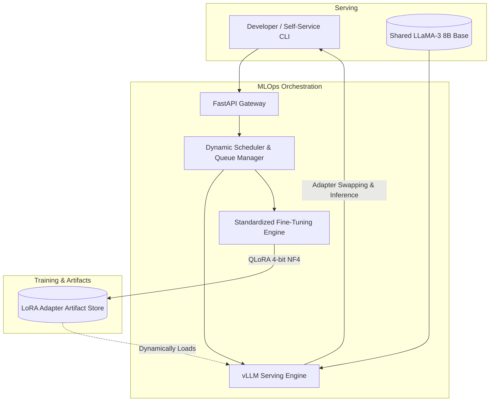

**Project:** On-Prem LLM Fine-Tuning & Serving Framework  
**Role:** Machine Learning Engineer / Platform Architect  
**Technologies:** Python, vLLM, QLoRA, FastAPI, React, TypeScript, PyTorch, PEFT  
**Domain:** Large Language Models (LLMs), MLOps, Model Serving, Enterprise Infrastructure

## Executive Summary
For enterprise organizations constrained by strict data-residency requirements, passing sensitive data to external APIs (like OpenAI) is a non-starter. The **On-Prem LLM Fine-Tuning & Serving Framework** is a standardized platform for on-premise QLoRA fine-tuning and dynamic vLLM-based serving. By standardizing the fine-tuning pipelines and leveraging dynamic LoRA adapter-swapping, the framework cut model-to-production time from 6 weeks to 9 days, driving massive GPU memory savings (45%) and empowering product teams with self-service AI capabilities.

## The Challenge
Deploying open-source LLMs locally introduces several severe infrastructural friction points:
- **Redundant VRAM Bloat**: Fine-tuning a 7B or 8B model for multiple distinct tasks (e.g., entity extraction, summarization, routing) usually requires loading full model weights into VRAM for every task, rapidly exhausting expensive GPU resources.
- **Slow Deployment Cycles**: Setting up custom training loops and serving architecture for every new product team caused a 6-week bottleneck.
- **Data Residency**: Cloud-hosted fine-tuning services violated strict internal compliance mandates.
- **GPU Idling**: Under-utilized GPUs during serving represent massive wasted capital.

## The Solution: Standardized QLoRA & Dynamic Adapter Swapping

I architected the framework as an end-to-end orchestration layer. Instead of duplicating base models, the system trains lightweight QLoRA adapters and dynamically swaps them into a single, shared 4-bit quantized base model during inference.

### Core Technical Pillars:

1. **QLoRA & 4-bit NF4 Quantization**: Implemented a standardized pipeline utilizing `peft` and `bitsandbytes` to perform 4-bit NormalFloat (NF4) double-quantization. This enables full fine-tuning of LLaMA-3 on consumer-grade or standard enterprise GPUs without out-of-memory (OOM) errors.
2. **vLLM Dynamic Adapter Swapper**: Engineered a serving gateway backed by vLLM that serves dozens of distinct fine-tuned tasks simultaneously. It holds one base model in VRAM and uses an LRU cache to dynamically swap lightweight LoRA adapters in milliseconds.
3. **Dynamic Scheduler & Queue Manager**: To eliminate GPU idle time, a custom queue manager batches incoming requests and saturates the GPU compute streams efficiently.
4. **Self-Service React UI & CLI**: Built an intuitive CLI and a modern React + TypeScript dashboard to calculate VRAM requirements, launch fine-tuning jobs, and monitor queue depth without requiring ML engineering intervention.

## Key Features & Business Impact

### 1. 78% Faster Deployment Cycles
By standardizing the entire MLOps lifecycle into a single framework, 4 internal product teams were able to bypass the ML engineering backlog. Model-to-production time was slashed from **6 weeks to 9 days**.

### 2. Extreme GPU Memory Savings
Dynamic adapter swapping over a single shared base model drove a **45% reduction in GPU memory overhead**. Instead of allocating 16GB per task, the system allocates 16GB *once* for the base model, plus roughly ~50MB per task adapter. 

## Empirical Evidence & Outcomes

- **Accuracy Improvement**: Utilizing the standardized QLoRA pipeline raised extraction F1 accuracy from **81% to 96%** on domain-specific logistics compliance documents.
- **Compute Saturation**: The dynamic batching scheduler successfully reduced GPU idle time by **35%**, optimizing cloud/on-prem hardware ROI.

---

> *"The On-Prem LLM Fine-Tuning & Serving Framework proves that on-premise Generative AI can be just as agile and scalable as cloud-based solutions. By leveraging vLLM and dynamic LoRA swapping, the architecture democratizes LLM deployment internally while ruthlessly optimizing GPU economics."*

