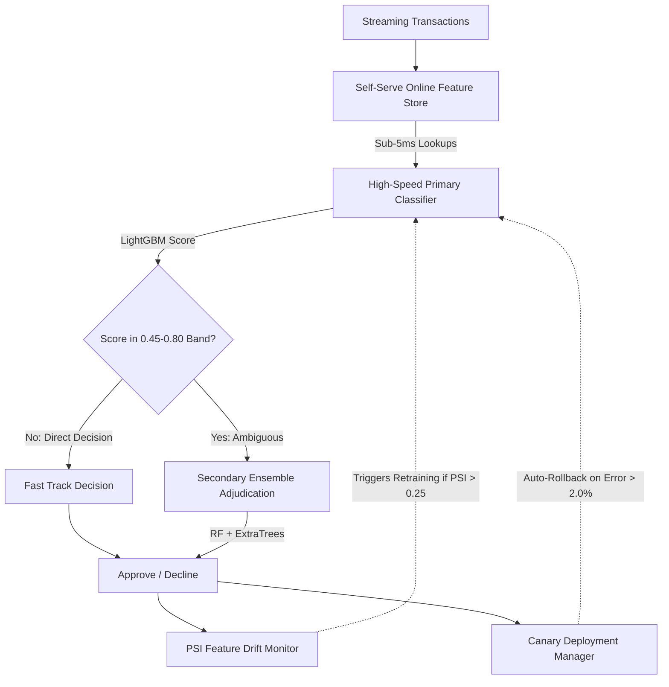

**Project:** Real-Time Fraud Scoring Pipeline  
**Role:** Senior Machine Learning Engineer  
**Technologies:** Python, LightGBM, FastAPI, Feature Store, Docker  
**Domain:** FinTech, Fraud Detection, Streaming Analytics, MLOps

## Executive Summary
In financial technology, fraud detection is a constant race against time. Systems must score millions of transactions with extreme accuracy; a delayed response frustrates users, while a false decline damages merchant relationships. The **Real-Time Fraud Scoring Pipeline** is a high-throughput, low-latency streaming system that successfully scores 1.2M+ daily transactions at **&lt; 180ms p95 latency**. By implementing a two-tier ensemble classifier and automated feature-drift monitoring, the pipeline reduced false-positive rates by 75% and slashed production incident recovery times from ~50 minutes to under 8 minutes.

## The Challenge
The legacy fraud detection architecture suffered from three critical flaws:
- **Latency Bottlenecks**: Inference times averaged 2.1 seconds, causing transaction timeouts.
- **High False Positive Rates**: A staggering 14.0% of legitimate transactions were flagged as fraud, resulting in devastating "false declines" for honest customers.
- **Model Degradation**: Fraud patterns evolve rapidly. The legacy model frequently drifted, and updating it required weeks of manual retraining, leading to significant financial losses during drift periods.
- **Brittle Deployments**: Deploying a new model took over an hour to rollback if it failed in production.

## The Solution: A Layered Streaming Architecture

To achieve sub-200ms latency while increasing accuracy, I architected a multi-stage streaming pipeline built around a self-serve online feature store and a dual-model adjudication engine.

### Core Technical Pillars:

1. **Two-Tier Layered Classifier**:
   - **Primary Model**: A high-speed LightGBM classifier that evaluates basic transaction features in under 10ms.
   - **Secondary Ensemble Model**: Triggered *only* for ambiguous transactions (scores between 0.45 and 0.80). This Random Forest/ExtraTrees ensemble uses deeper feature interactions to eliminate false alarms without bogging down the entire pipeline.
2. **Self-Serve Online Feature Store**: Engineered a low-latency key-value feature store providing sub-5ms lookups for sliding-window features (e.g., `txn_count_1h`, `device_risk_score`), drastically reducing data scientist onboarding time from 3 weeks to 5 days.
3. **Automated MLOps Automation**: 
   - **PSI Drift Monitor**: Tracks feature distribution shifts in real-time. If the Population Stability Index exceeds 0.25, the system automatically triggers a weekly retraining pipeline.
   - **Canary Deployments**: New models are tested on 10% of live traffic. If error rates exceed 2.0%, the system automatically executes a rollback in under 5 minutes.

## Key Features & Business Impact

### 1. Massive Reduction in False Declines
By layering the secondary ensemble model and validating against a 50,000-case labeled dataset, the False Positive Rate plummeted from **14.0% to 3.5%**. Concurrently, the false-decline rate on legitimate transactions dropped by **9%**, significantly boosting merchant revenue.

### 2. Unprecedented Speed and Cost Efficiency
The transition to asynchronous streaming slashed inference latency by **~92%** (from 2.1s down to &lt; 180ms p95 latency) while simultaneously cutting per-transaction compute costs by **64%**.

## Empirical Evidence & Outcomes

- **Incident Mitigation**: The automated canary rollback framework cut production incident Mean Time To Recovery (MTTR) from **~50m to ~8m (~84% reduction)**.
- **Drift Management**: Automated PSI monitoring and retraining reduced model-drift incidents by **80%**.

---

> *"The Real-Time Fraud Scoring Pipeline illustrates the pinnacle of FinTech MLOps. By decoupling the high-speed initial assessment from the deep-feature ensemble evaluation, it proves that you do not have to sacrifice analytical depth to achieve sub-200ms streaming SLAs."*

