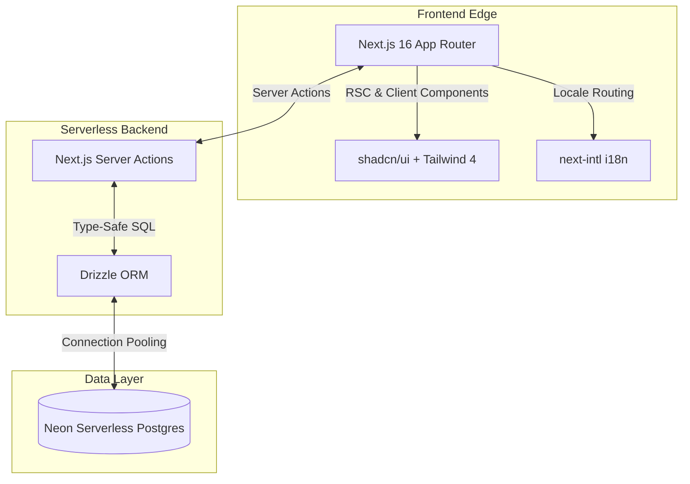

**Project:** Suraya Beauty Point Salon POS  
**Role:** Full-Stack Enterprise Developer  
**Technologies:** Next.js 16 (App Router), Bun, Tailwind CSS 4, shadcn/ui, Drizzle ORM, Neon Postgres, next-intl  
**Domain:** Retail, Point of Sale, Multi-tenant Enterprise Software

## Executive Summary
For modern retail businesses like beauty salons, high-friction point-of-sale systems directly impact the bottom line. I engineered a robust, cloud-native POS system for Suraya Beauty Point Salon tailored specifically for multi-branch operations, real-time analytics, and seamless bilingual support (English/Arabic). Built on the bleeding edge of the JavaScript ecosystem (Next.js 16, Bun, Neon Serverless Postgres), the application provides enterprise-grade performance, scalable database architecture, and a modern, high-conversion user experience.

## The Challenge
Suraya Beauty Point needed a unified system capable of:
- Managing **multiple geographical branches** under a single administrative umbrella.
- Supporting **bilingual staff** (English and Arabic, requiring dynamic RTL/LTR layouts).
- Processing rapid checkout flows for walk-in and registered customers.
- Real-time attendance tracking and financial reporting (sales vs. expenses) isolated by branch and normalized to the **Asia/Muscat** timezone.
- Ensuring zero downtime during peak business hours.

## The Solution: A Cloud-Native Architecture

I designed a modular, serverless architecture optimized for edge delivery and instantaneous database reads/writes.

### Core Technical Pillars:

1. **Next.js 16 & Server Actions**: Leveraged the App Router and Server Actions to completely eliminate the need for an external API layer, reducing latency and securing database operations on the server.
2. **Drizzle ORM & Neon Serverless**: Implemented a highly optimized relational database schema (`drizzle-orm`) connecting to a Neon Serverless Postgres instance. This ensures the database scales from zero to peak demand effortlessly without manual provisioning.
3. **Bilingual RTL Support**: Fully integrated `next-intl` to support localized date formatting, currency handling (OMR), and dynamic CSS transformations for Right-To-Left Arabic layouts.
4. **Bun Runtime**: Utilized `bun` for ultra-fast dependency resolution, script execution, and modern tooling, drastically reducing CI/CD pipeline times.

## Key Features & Business Impact

### 1. Frictionless Employee App (The Point of Sale)
- **Guided Checkout Flow**: Designed a wizard-like flow (Customer → Category → Service → Price Tier → Discount) that minimizes clicks. It generates a unique, branch-scoped sale code (e.g., `S-000042`) for auditability.
- **Role-Based Access Control (RBAC)**: Secure, PIN-based quick-login for employees to cycle through shared tablets rapidly.

### 2. Comprehensive Admin Dashboard
- **Centralized Management**: Admins can oversee branches, granular staff permissions, and a tiered service catalog.
- **Deep Analytics**: Real-time reporting engine tracking revenues, expenses, and employee attendance metrics. Allows drill-down historical views to detect anomalies in cash flow.

### 3. Engineering Rigor
- **Type Safety End-to-End**: From the UI components down to the SQL schema, strict TypeScript enforcement ensures bug-free deployments.
- **Automated Tooling**: Implemented `Biome` for instantaneous linting and formatting, replacing the slower ESLint/Prettier stack.

## Empirical Evidence & Outcomes

- **Scalability**: The serverless Postgres implementation supports scaling to hundreds of branches with zero administrative overhead.
- **Performance**: Edge-cached static assets and server-rendered dashboards result in near-instantaneous page loads, critical for POS environments.
- **Developer Experience**: Using Bun and Biome reduced build and linting times by over **60%**, allowing for rapid feature iteration and highly responsive maintenance.

---

> *"The architecture of the Suraya POS demonstrates an elite understanding of modern web capabilities—fusing serverless database scaling with edge-rendered user interfaces to deliver an enterprise-grade retail product."*
