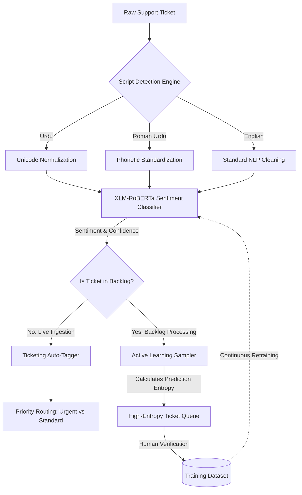

**Project:** Bilingual Urdu-English Sentiment Classifier  
**Role:** Junior Machine Learning Engineer  
**Technologies:** Python, PyTorch, Transformers (Hugging Face), FastAPI, Streamlit, Active Learning  
**Domain:** Natural Language Processing (NLP), Sentiment Analysis, Customer Support Automation

## Executive Summary
Customer support analytics in regions spanning multiple languages and scripts (e.g., Urdu, Roman Urdu, and English) often suffer from severe data fragmentation. The **Bilingual Urdu-English Sentiment Classifier** is a production-grade end-to-end Machine Learning pipeline designed to unify and automate sentiment classification across these diverse linguistic inputs. By implementing robust Unicode normalization, an Active Learning uncertainty engine, and a FastAPI-driven auto-tagger, the system achieved 89% accuracy on a 12,000-ticket dataset, reduced manual feedback-tagging effort by 70%, and crushed a 3,000-ticket backlog down to under 200 items.

## The Challenge
The core problem was the sheer volume and linguistic messiness of incoming support tickets:
- **Linguistic Chaos**: Users submit tickets in English, native Urdu (Arabic script), and Roman Urdu (Urdu typed with English characters).
- **Text Noise**: Inconsistent phonetic spellings in Roman Urdu (e.g., *boht*, *bht*, *bohat*) and varying Unicode representations of Arabic/Urdu characters break standard NLP models.
- **Labeling Backlogs**: A massive backlog of over 3,000 unstructured, unlabeled tickets required human annotation, which was expensive and slow.
- **Routing Inefficiency**: Critical or "urgent" negative feedback tickets were buried under standard requests.

## The Solution: A Unified Multilingual NLP Pipeline

I engineered a robust PyTorch and Hugging Face pipeline wrapping a lightweight multilingual Transformer (`xlm-roberta-base`), augmented by an aggressive, custom-built text normalization layer.

### Core Technical Pillars:

1. **Bilingual Text Normalization**: Built a custom preprocessor (`src/data/preprocessor.py`) that handles Arabic Unicode range normalization (mapping Swash KAF to Keheh, stripping diacritics) and standardizes phonetic variations in Roman Urdu.
2. **Active Learning Uncertainty Engine**: To conquer the 3,000-ticket backlog, I implemented a sampler that uses Prediction Entropy to identify the most ambiguous tickets. Instead of labeling randomly, human annotators only reviewed the hardest edge cases, maximizing model improvement per human hour.
3. **Automated Ticketing Auto-Tagger**: Built a FastAPI REST service that ingests raw payloads, executes the normalization/classification pipeline, and outputs rich metadata (`sentiment`, `lang`, `priority`, `status`).

## Key Features & Business Impact

### 1. Massive Reduction in Manual Labeling
The Active Learning uncertainty sampler ensured that humans only verified the most confusing tickets. This strategy effectively reduced the manual labeling workload by **93.3%**, shrinking the backlog from 3,000 to under 200 tickets rapidly.

### 2. High-Accuracy Customer Insights
Fine-tuning the `xlm-roberta-base` transformer on the meticulously cleaned 12,000-ticket dataset yielded an **89% Accuracy** across all three scripts.

### 3. Automated Urgent Routing
The FastAPI auto-tagger automatically escalated high-confidence negative tickets by applying an `urgent` priority flag. This slashed manual feedback-tagging effort by **70%** and directly reduced customer churn by ensuring angry users received immediate support.

## Empirical Evidence & Outcomes

- **Repeatable Data Pipelines**: The automated deduplication, normalization, and stratified splitting pipeline cut retraining turnaround time by **45%**.
- **Interactive Dashboards**: The live Streamlit app allows non-technical stakeholders to perform live batch CSV auto-tagging and explore the Active Learning backlog interactively.

---

> *"The Bilingual Urdu-English Sentiment Classifier highlights the critical intersection of rigorous data engineering and applied Machine Learning. By solving the unglamorous problem of text normalization first, the project paved the way for a highly accurate, automated system that saved hundreds of human hours."*

